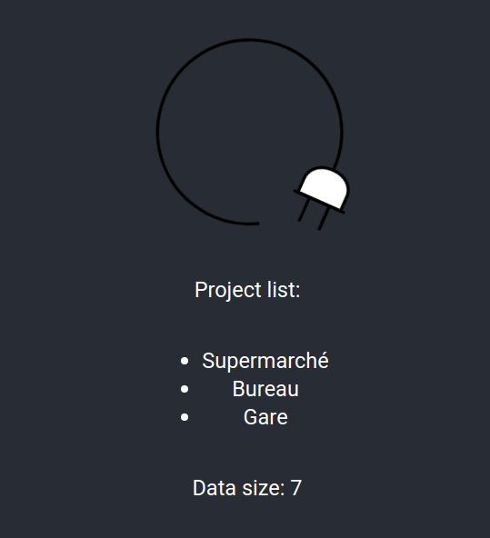
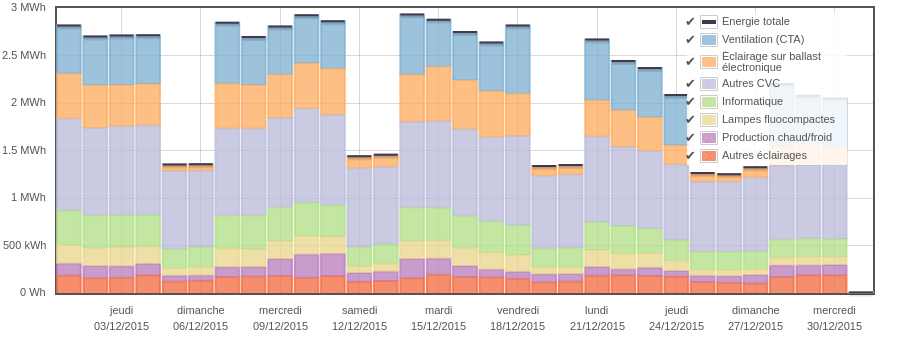

# Test métier React - Smart Impulse

Ce projet a été créé avec [Create React App](https://github.com/facebook/create-react-app).

## Scripts disponibles et détails

Depuis le dossier principal, vous pouvez lancer:

### `yarn start`

Lance l'app en mode de développement.\
Le serveur est disponible à l'adresse [http://localhost:3000](http://localhost:3000).

L'appli React se recharge automatiquement quand des modifications sont apportées sur le code client.

Un serveur d'API se lance également en arrière plan, à l'adresse [http://localhost:4000](http://localhost:4000).\
Le code de ce serveur est dans le fichier `server.js`. C'est une simple API qui répond à quelques requêtes en renvoyant le contenu de fichiers JSON.\
Le fichier `packages.json` contient l'instruction `proxy`, qui permet d'automatiquement appeler le serveur depuis le client de façon transparente.

Le fichier `App.js` montre les 2 points d'entrée de l'API:
* `GET /api/projects` renvoie le détail des projets disponibles (tel que le ferait un site réel une fois l'utilisateur connecté). Chaque projet a un nom, une timezone (heure de Paris pour tous les projets ici) et un `uuid`.
* `GET /api/energy?uuid=UUID` renvoie les données associées à un projet. C'est une liste des catégories d'équipements qui ont été calculées par les algorithmes de Smart Impulse. Chaque série de données a un label, un type (notamment une catégorie `total` qui est la somme des autres), et des `data`: une liste de valeurs `[timestamp_in_utc, value_in_watt_hour]`. Le timestamp correspond au début de la journée, minuit dans le fuseau horaire du projet, et converti en UTC. La valeur correspond à l'énergie de la catégorie pour la journée.

### `yarn test`

Lance le runner de test en mode interactif.\
**Un test est en place pour vérifier que l'application se charge.**\
Pour plus de détails, se reporter à la documentation [running tests](https://facebook.github.io/create-react-app/docs/running-tests).

## Préparation

1. Si vous n'avez pas **nodejs en version >= 12**, suivre les [instructions d'installation de nodejs](https://nodejs.org/en/download/)
2. Si vous n'avez pas `yarn`, suivre les [instructions d'installation de yarn](https://classic.yarnpkg.com/en/docs/install)
3. Installez les dépendances du test métier en lançant `yarn` depuis le dossier du projet.
4. Lancer le projet avec `yarn start`
5. Vérifiez que tout se passe bien en ouvrant la page [http://localhost:3000](http://localhost:3000) et vérifier que son contenu correspond à l'image:

## Objectif

Construire une petite application React, qui doit être capable de :
* Interroger le serveur d'API via des requêtes asynchrones (`fetch` ou similaire)
* Naviguer parmi les projets que renvoie l'API
* Après sélection d'un projet, tracer les données d'énergie par jour dans un graphe en barres empilées.

Voici un exemple de représentation de l'énergie consommée pour chaque catégorie sur chaque jour d'un mois :

**Choisissez une librairie de graphes, et expliquez votre choix.**\
Quelques critères importants: responsiveness, rapidité du tracé, zoom/déplacement de la période zoomée. Les pistes de la section [Pour aller plus loin](#next) donnent quelques autres critères.

**Choisissez une librairie d'UI** (ex : Material-UI, Ant design...) pour avoir des composants sympa pour construire l'interface.

### Pour aller plus loin

Si vous souhaitez approfondir le test pour mieux montrer vos compétences, voilà quelques pistes :

* affichage de la légende sur le graphe
* sélection de la sous-période à afficher par un sélecteur de dates (certains projets durent 10 ans !)
* permettre à l'utilisateur de choisir une visualisation différente en cumulant les données par semaine ou mois
* affichage stylisé des axes (unités, format des dates)
* bonne gestion du fuseau horaire pour l’affichage de données mesurées à l'autre bout du monde
* Calcul d'informations synthétiques : énergie minimale/moyenne/maximale de chaque catégorie
* possibilité de conversion du graphe en euros (par exemple 1 MWh = 83 €)
* ce que vous avez envie d’expérimenter !

## Documents à renvoyer

Merci de nous renvoyer les documents suivants :
* Votre code source
* Les raisons de votre choix de librairie pour les graphes
* Tout document qui vous semblerait utile pour décrire votre travail
* Des copies d’écrans montrant votre résultat

Merci et bon courage !
